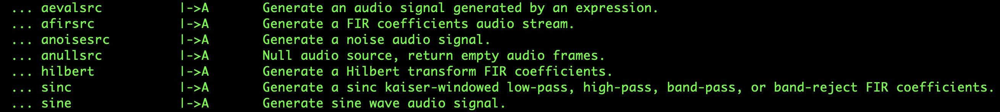
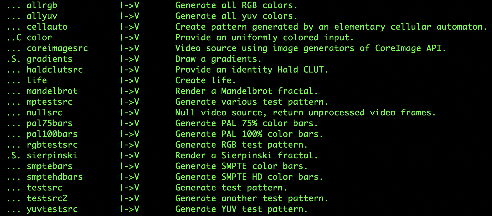

# 生成测试音视频

要生成用于测试的音频文件或视频文件，我们需要使用`libavfilter`虚拟输入设备，也就是`lavfi`，当使用它时，输入文件（也就是`-i`选项）需要是一个`source`滤镜或`sink`滤镜。查看有哪些`source`滤镜或`sink`滤镜，可以通过`ffmpeg -filters`进行查询。

例如，下面这些滤镜可以用来生成用于测试的音频：

`ffmpeg -f lavfi -i anoisesrc anoisesrc.mp3`

下面这些滤镜可以用来生成用于测试的视频：

`ffmpeg -f lavfi -i mandelbrot mandelbrot.mp4`
