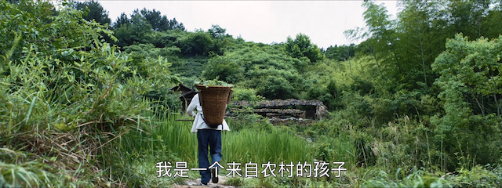

# 填充画面

填充画面，指的是在画面边缘添加额外的区域。

## pad 滤镜

填充画面需要用到`pad`滤镜。关于该滤镜的具体选项，可以通过`ffmpeg -h filter=pad`进行查看。

比如，在画面周围填充`40`像素，并把填充区域的颜色设置为粉红色：

`ffmpeg -i 1.mp4 -vf "pad=w=iw+40:h=ih+40:x=(ow-iw)/2:y=(oh-ih)/2:color=pink" 2.mp4`

注意，由于在滤镜选项中使用了表达式，所以需要为滤镜部分添加引号。表达式中的的`iw`、`ih`、`ow`、`oh`为滤镜内置变量，分别表示`输入宽度`、`输入高度`、`输出宽度`、`输出高度`。

