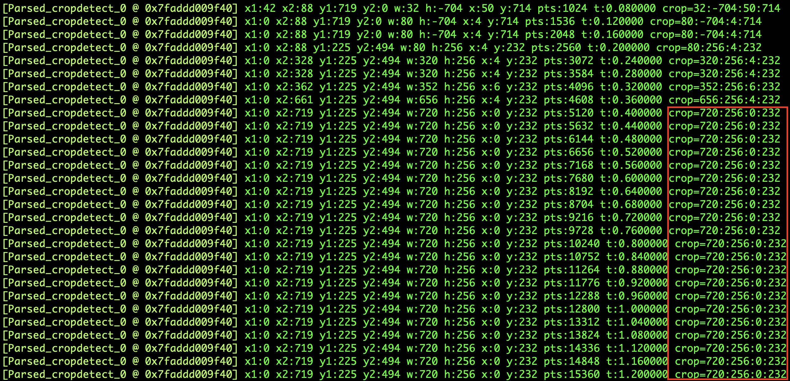

# 裁剪画面

裁剪画面，可以使用以下滤镜：

* crop
* cropdetect

## crop 滤镜

裁剪画面需要使用`crop`滤镜，关于该滤镜的具体选项，可以通过`ffmpeg -h filter=crop`进行查看。

比如，裁剪画面中心区域（这里，我们把裁剪后的宽高设置为原来的三分之一）：

`ffmpeg -i 1.mp4 -vf crop=w=iw/3:h=ih/3 2.mp4`

## cropdetect 滤镜

关于该滤镜的具体选项，可以通过`ffmpeg -h filter=cropdetect`进行查看。

例如上面的画面，边缘有黑色区域，我们想要把黑色区域裁剪掉，就需要用到`cropdetect`滤镜，当然，边缘区域有可能并不是纯黑的，通常需要使用该滤镜的`limit`选项，用它指定一个阈值，低于该阈值的像素，就会被认定为黑色。

**使用`cropdetect`滤镜时，它会输出裁剪区域，随后我们可以使用输出的裁剪区域，把画面边缘的黑色区域裁剪掉。**

首先使用`cropdetect`滤镜，获取到裁剪区域：

`ffmpeg -i 1.mp4 -vf cropdetect=limit=255 -vframes 10 2.mp4`

运行命令后，输出信息中会有类似这样的信息

当输出的`crop=?:?:?:?`稳定时（如，上图中的圈红部分），我们就可以用这个裁剪区域裁剪掉黑色区域了（注意，虽然在使用`cropdetect`滤镜时，指定了输出文件，但这个文件展示出来的画面还是保留着黑色区域的）。

使用得到的裁剪区域，裁剪掉画面边缘的黑色区域：

`ffmpeg -i 1.mp4 -vf crop=720:256:0:232 -y 2.mp4`