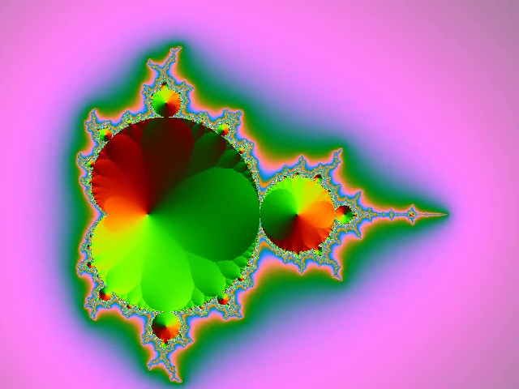

# 翻转画面

翻转画面，可以使用以下滤镜：

* hflip
* vflip

## hflip 滤镜

水平翻转画面，需要使用`hflip`滤镜。

`ffmpeg -i mandelbrot.mp4 -vf hflip mandelbrot-hflip.mp4`

| 原始 | 水平翻转 |
|---|---|
|  |  |

## vflip 滤镜

垂直翻转画面，需要使用`vflip`滤镜。

`ffmpeg -i mandelbrot.mp4 -vf vflip mandelbrot-vflip.mp4`

| 原始 | 垂直翻转 |
|---|---|
|  |  |

