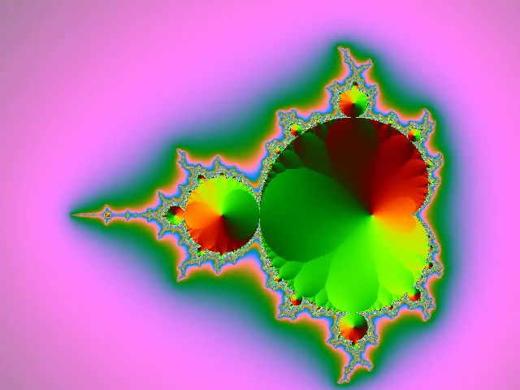
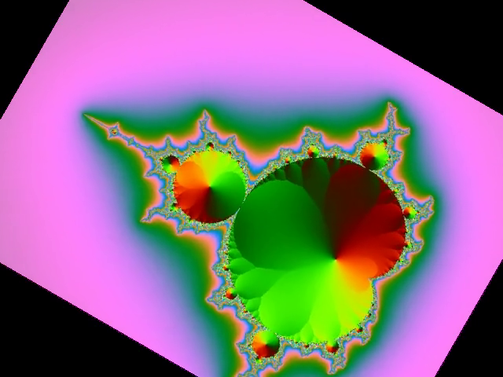
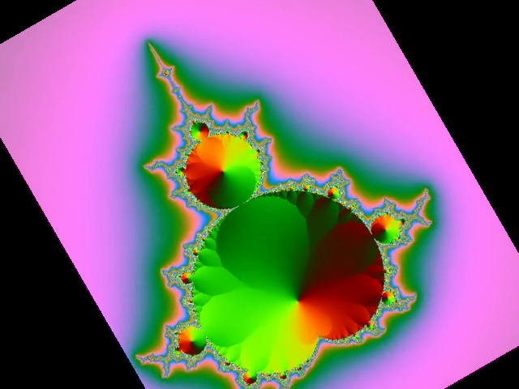
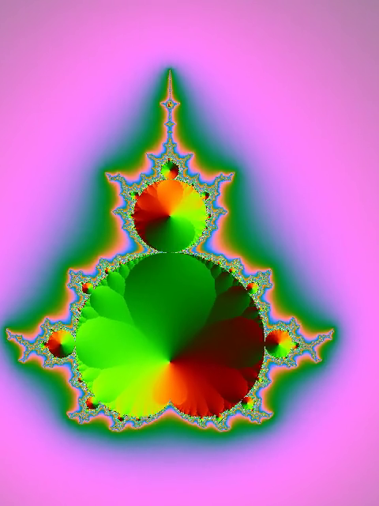
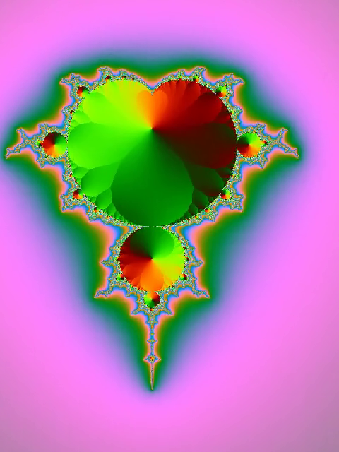
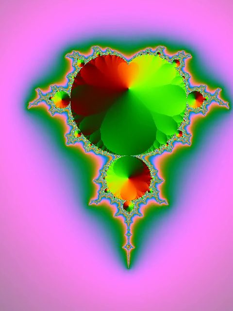
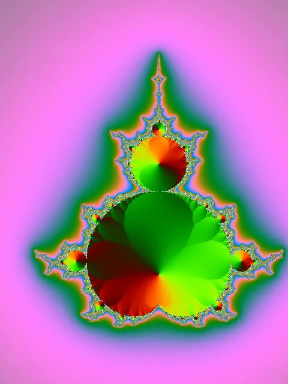

# 旋转画面

旋转画面，可以使用以下滤镜：

* rotate
* transpose

## rotate 滤镜

关于该滤镜的具体选项，可以通过`ffmpeg -h filter=rotate`进行查看。

顺时针旋转六分之一π弧度（30度）：

`ffmpeg -i mandelbrot.mp4 -vf "rotate=a=PI/6" mandelbrot-rotate-30.mp4`

| 原始 | 顺时针旋转30度 |
|----|----------|
|  |  |

顺时针旋转三分之一π弧度（60度）：

`ffmpeg -i mandelbrot.mp4 -vf "rotate=a=PI/3" mandelbrot-rotate-60.mp4`

| 原始 | 顺时针旋转60度 |
|----|----------|
|  |  |

## transpose 滤镜

关于该滤镜的具体选项，可以通过`ffmpeg -h filter=transpose`进行查看。

顺时针旋转90度：

`ffmpeg -i mandelbrot.mp4 -vf transpose=dir=clock mandelbrot-transpose-clock.mp4`

| 原始 | 顺时针旋转90度 |
|----|----------|
| | |

顺时针旋转90度并垂直翻转：

`ffmpeg -i mandelbrot.mp4 -vf transpose=dir=clock_flip mandelbrot-transpose-clock_flip.mp4`

| 原始 | 顺时针旋转90度并垂直翻转 |
|----|----------|
| | |

逆时针旋转90度：

`ffmpeg -i mandelbrot.mp4 -vf transpose=dir=cclock mandelbrot-transpose-cclock.mp4`

| 原始 | 逆时针旋转90度 |
|----|----------|
| | |

逆时针旋转90度并垂直翻转：

`ffmpeg -i mandelbrot.mp4 -vf transpose=dir=cclock_flip mandelbrot-transpose-cclock_flip.mp4`

| 原始 | 逆时针旋转90度并垂直翻转 |
|----|----------|
| | |