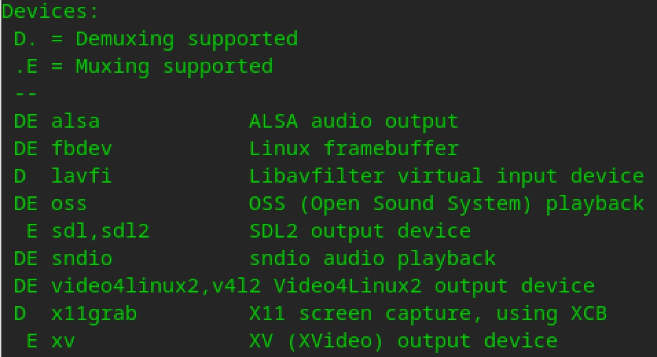
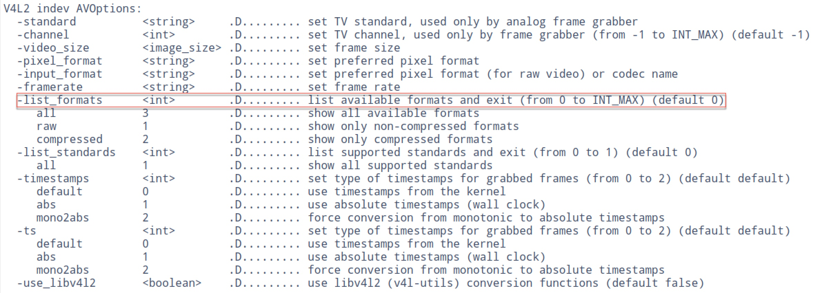
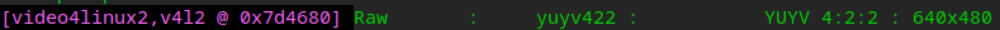
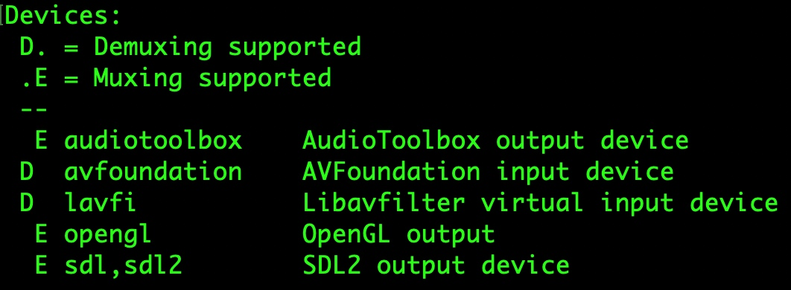
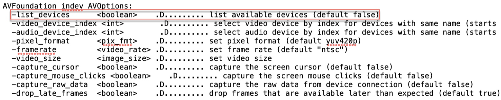
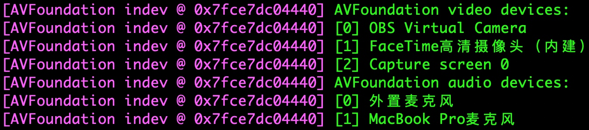
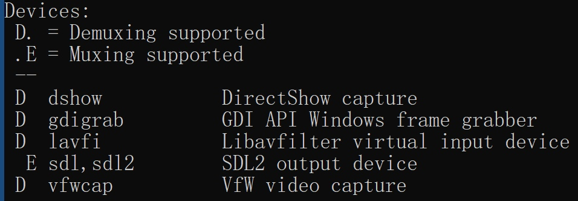
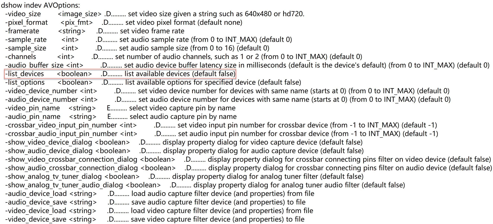
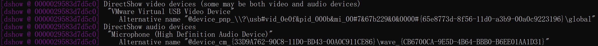

# 采集

采集包括录屏、录音、使用摄像头捕获画面。

## 列出有哪些设备

### Linux

`ffmpeg -devices`

列出`V4L2`可用的像素格式

`ffmpeg -list_formats all -f v4l2 -i /dev/video0`

### macOS

`ffmpeg -devices`

列出`avfoundation`可用的设备：

`ffmpeg -list_devices true -f avfoundation -i ''`

### Windows

`ffmpeg -devices`

`ffmpeg -list_devices true -f dshow -i ''`

## 录屏

### Linux

`ffplay -f x11grab -i :0.0`

`ffmpeg -f x11grab -i :0.0 out.mp4`

### macOS

`ffplay -f avfoundation -pixel_format nv12 -probesize 10M -i 'Capture screen 0'`

`ffmpeg -f avfoundation -pixel_format nv12 -probesize 10M -i 'Capture screen 0' out.mp4`

> 不加入`-probesize`选项，会出现警告：`not enough frames to estimate rate; consider increasing probesize`

### Windows

`ffplay -f gdigrab -probesize 10M -i desktop`

`ffmpeg -f gdigrab -probesize 10M -i desktop out.mp4`

## 采集摄像头画面 & 采集声音

### Linux

`ffplay -f v4l2 -framerate 24 -video_size 640x480 -i /dev/video0 -f alsa -i default`

`ffmpeg -f v4l2 -framerate 24 -video_size 640x480 -i /dev/video0 -f alsa -i default out.mp4`

### macOS

`ffplay -f avfoundation -video_size 640x480 -framerate 30 -pixel_format nv12 -i 'FaceTime高清摄像头（内建）:外置麦克风'`

`ffmpeg -f avfoundation -video_size 640x480 -framerate 30 -pixel_format nv12 -i 'FaceTime高清摄像头（内建）:外置麦克风' out.mp4`

### Windows

`ffplay -rtbufsize 256M -f dshow -i "video=VMware Virtual USB Video Device:audio=Microphone (High Definition Audio Device)"`

`ffmpeg -rtbufsize 256M -f dshow -i "video=VMware Virtual USB Video Device:audio=Microphone (High Definition Audio Device)" out.mp4`

> 不加入`-rtbufsize`选项，可能会出现这样的警告信息：`real-time buffer [XXX XXX XXX] [video input] too full or near too full (80% of size: 3041280 [rtbufsize parameter])! frame dropped!`，将其设置为较大的值就可以解决

## 实战：采集视频，添加旋转的水印（徽标），并播放

### Linux

`ffmpeg -f v4l2 -framerate 24 -video_size 640x480 -i /dev/video0 -loop true -i linux-logo-64.png -filter_complex "[1:v]format=pix_fmts=rgba,rotate=PI/6*t:ow=hypot(iw\,ih):oh=ow:c=0x00000000[logo];[0:v][logo]overlay=x=(W-w)/2:y=(H-h)/2" -pix_fmt yuv420p -f sdl ''`

`ffmpeg -f lavfi -i testsrc -loop true -i linux-logo-64.png -filter_complex "[1:v]format=pix_fmts=rgba,rotate=PI/6*t:ow=hypot(iw\,ih):oh=ow:c=0x00000000[logo];[0:v][logo]overlay=x=(W-w)/2:y=(H-h)/2" -pix_fmt yuv420p -f sdl ''`

### macOS

#### -loop 选项

`ffmpeg -f avfoundation -video_size 640x480 -framerate 30 -pixel_format nv12 -i 1 -loop true -i linux-logo-64.png -filter_complex "[1:v]format=pix_fmts=rgba,rotate=PI/6*t:ow=hypot(iw\,ih):oh=ow:c=0x00000000[logo];[0:v][logo]overlay=x=(W-w)/2:y=(H-h)/2" -pix_fmt yuv420p -f sdl ''`

#### loop 滤镜

`ffmpeg -f avfoundation -video_size 640x480 -framerate 30 -pixel_format nv12 -i 1 -vf "movie=filename=linux-logo-64.png,loop=loop=-1:size=1,format=pix_fmts=rgba,rotate=a=PI/6*t:ow=hypot(iw\,ih):oh=ow:c=0x00000000[logo],[in][logo]overlay=x=(W-w)/2:y=(H-h)/2" -pix_fmt yuv420p -f sdl ''`

### Windows

#### loop 滤镜

`ffmpeg -rtbufsize 1024M -f dshow -i "video=VMware Virtual USB Video Device" -vf "movie=filename=linux-logo-64.png,loop=loop=-1:size=1,format=rgba,rotate=a=PI/6*t:ow=hypot(iw\,ih):oh=ow:c=0x00000000[logo],[in][logo]overlay" -pix_fmt yuv420p -f sdl ' '`

> 还记得在`第03章`提到的内容吗？在`Windows`中，输出文件名不能是空字符串，但可以是空白字符串：`-f sdl`后面的`' '`。

